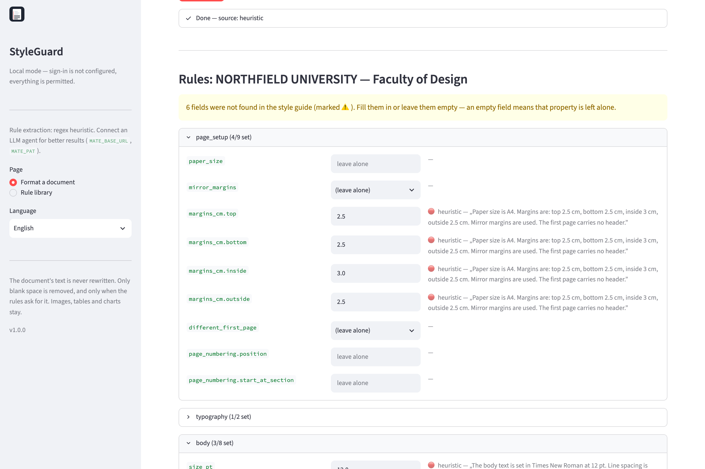
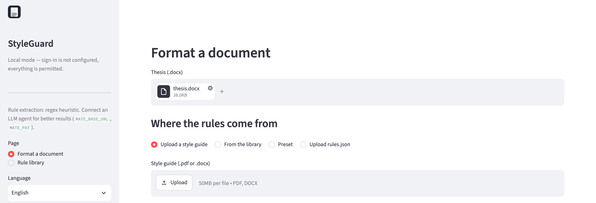
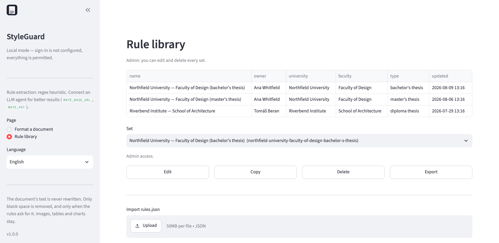
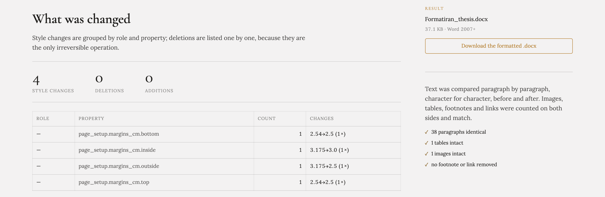

# StyleGuard

[](https://github.com/antiv/styleguard/releases/latest)
[](https://github.com/antiv/styleguard/actions/workflows/ci.yml)
[](LICENSE)
[](https://www.python.org/downloads/)
[](https://streamlit.io/)
[](Dockerfile)
[](locales/)

Formats a `.docx` academic thesis to match an institution's style guide. You
upload the style guide as `.pdf` or `.docx`; an LLM agent extracts the rules
from it, with a regex heuristic as fallback. Extracted rule sets are saved to a
library and offered again automatically when the same institution is
recognised.



*Every extracted rule carries where it came from, how confident the extraction
was, and the sentence in the style guide it was read from. Fields the guide
does not mention stay empty and are left alone.*

## What it does, and what it refuses to do

**Does:** page setup and margins, mirror margins, font family and sizes, line
spacing and paragraph spacing, alignment, headings per level, figure and table
captions, source lines, bibliography, tables, and optionally a real Word TOC
field.

**Does not:** change a single character of text. No renaming, no dash
substitution, no `.upper()` — the `UPPERCASE` rule is applied through Word's
`w:caps` run property, so the heading renders in capitals while the text stays
untouched.

**Deletes whitespace only**, and only when the rules ask for it
(`body.allow_empty_paragraphs: false`): empty paragraphs in the body and
bibliography, and empty paragraphs carrying a manual page break. It never
deletes a paragraph containing an image, a chart, a field, a footnote or a
bookmark, never touches tables, and never removes `w:sectPr`.

## Running it

```bash
python -m venv .venv && .venv/bin/pip install -r requirements.txt

.venv/bin/streamlit run app.py          # web app
.venv/bin/python cli.py --help          # command line
```



### LLM agent (optional)

Rule extraction works without it, falling back to a regex heuristic that covers
font, size, line spacing, margins and alignment — and marks everything it finds
as low confidence.

The client speaks the OpenAI chat-completions protocol, so any compatible
endpoint works. It was built and tested against
[Mate](https://github.com/antiv/mate), which exposes agents on that protocol.

```bash
export MATE_BASE_URL=http://localhost:8000
export MATE_PAT=<Personal Access Token from the Mate dashboard>
export MATE_AGENT_NAME=doc_rules_extractor

.venv/bin/python cli.py mate ping
```

Import the agent from
[mate_agent/doc_rules_extractor.json](mate_agent/doc_rules_extractor.json) —
in the dashboard under Agents → Import JSON, or via the API:

```bash
curl -u admin:PASSWORD -H 'Content-Type: application/json' \
  --data @mate_agent/doc_rules_extractor.json \
  'http://localhost:8000/dashboard/api/agents/import?overwrite=true'
```

`overwrite` is a **query parameter**; in the body it is ignored and the import
silently skips an existing agent.

**The import does not carry `expose_as_model`** — without it
`/v1/chat/completions` returns 404. Enable it in the dashboard, or:

```bash
curl -u admin:PASSWORD -X PUT -H 'Content-Type: application/json' \
  -d '{"expose": true}' \
  http://localhost:8000/dashboard/api/agents/<ID>/expose
```

Beyond that:

- the agent must be a root agent (no parents) and not disabled
- `allowed_for_roles` must contain the caller's role. The template ships
  `["admin","developer","user"]`; drop `user` and the agent replies with
  **empty content** plus `RBAC: Access DENIED` in the log, with no HTTP error
- the caller must be allowed on the `/v1` route at all — `ALLOWED_API_ROLES`,
  `admin` or `developer` by default

Those are two different role checks and they are easy to confuse: the first
belongs to the agent, the second to the API.

The model is chosen in the dashboard. The agent instruction lives in
[styleguard/extract/prompt.py](styleguard/extract/prompt.py); after editing it run
`.venv/bin/python mate_agent/build_agent.py` and re-import the JSON. The rules
JSON schema is deliberately **not** baked into the agent — it is generated into
every request, so editing the model never requires a re-import.

## Command line

```bash
# formatting
cli.py format --input thesis.docx --rules guide.pdf --out formatted.docx
cli.py format --input thesis.docx --rules-id ameu --out formatted.docx
cli.py format --input thesis.docx --rules-id ameu --out out.docx --dry-run

# rules
cli.py extract guide.pdf --save-as "AMEU — Dance Academy"
cli.py library list | show <id> | copy <id> | delete <id> | import <file>

# diagnostics
cli.py structure thesis.docx --rules-id ameu
cli.py mate ping

# language for forwarded messages
cli.py --lang de format --input thesis.docx --rules-id ameu --out out.docx
```

`--offline` skips the LLM and uses the heuristic. `--dry-run` shows what would
be deleted without writing anything.

## Rule library

Rule sets are stored as JSON in `rules_library/`, one file per set. When a new
style guide is uploaded, the issuing institution (university, faculty,
department) is identified first and matched against the library: above 0.90 an
existing set is proposed, 0.70–0.90 is shown as a possibility. The choice is
always the user's — two departments of the same faculty can have different
style guides.

Sets can be edited, copied (for "same faculty, different thesis type"),
exported and imported.



### Bundled rule sets

`presets/` ships rule sets read from real, published style guides, so the
library is not empty on a fresh install:

| `--rules-id` | Institution | City | Lang |
|---|---|---|---|
| `ub-master` | Univerzitet u Beogradu | Beograd | sr |
| `bg-ekof-seminarski` | Ekonomski fakultet | Beograd | sr |
| `ns-poljoprivredni` | Poljoprivredni fakultet | Novi Sad | sr |
| `ni-elfak` | Elektronski fakultet | Niš | sr |
| `sa-medicinski` | Medicinski fakultet | Sarajevo | bs |
| `sa-ppf` | Poljoprivredno-prehrambeni fakultet | Sarajevo | bs |
| `mo-masinski` | Mašinski fakultet, Univerzitet „Džemal Bijedić“ | Mostar | bs |
| `bl-tehnoloski` | Tehnološki fakultet | Banja Luka | sr |
| `zg-pravni` | Pravni fakultet | Zagreb | hr |
| `zg-agronomski` | Agronomski fakultet | Zagreb | hr |
| `st-ekonomski` | Ekonomski fakultet | Split | hr |
| `ri-pomorski` | Pomorski fakultet | Rijeka | hr |
| `me-ucg` | Univerzitet Crne Gore | Podgorica | sr |
| `sk-ekonomski` | Економски факултет, УКИМ | Скопје | mk |
| `lj-pef` | Pedagoška fakulteta | Ljubljana | sl |
| `lj-fpp` | Fakulteta za pomorstvo in promet | Ljubljana | sl |
| `mb-strojnistvo` | Fakulteta za strojništvo | Maribor | sl |
| `ameu` | Alma Mater Europaea, Akademija za ples | Ljubljana | sl |

Each one records the URL it was read from in `meta.source_filename`, and every
value carries the sentence it came from, with a page number. Those quotes are
not decoration: all 113 of them were checked back against the source PDF with
the same `verify_quote` guard the LLM extraction uses, and every one is an
exact substring. Nothing in these files was inferred.

They are not variations on one house style. Banja Luka's technology faculty
sets the body in **Arial 10 pt with 1.15 spacing** where almost everyone else
uses Times New Roman 12 at 1.5; Skopje measures its margins in **2.54 cm**
because the guide thinks in inches; Maribor's mechanical engineering faculty
and the Ljubljana maritime faculty both use **mirror margins** for
double-sided printing, so their inside margin is wider than the outside one.

A rule set is matched to the language it was written for. The Macedonian set
looks for `ВОВЕД`, not `UVOD`; applied to a Serbian thesis the run stops with
"the start of the main text was not found" rather than guessing — which is the
intended behaviour, not a limitation.

Fields the guide does not prescribe are left `null` and listed in
`unresolved` — a preset does not invent a margin because most theses have one.

**Style guides change.** These were read on 2026-08-10; check the rules against
your faculty's current version before submitting, and edit the set if it has
moved on.

## Reviewing rules before applying them

Extraction gets things wrong, so nothing is applied without confirmation. Every
rule is shown with its origin (LLM / heuristic / manual / preset), a confidence
level, and the quote from the style guide it came from. A rule whose quote
cannot be found in the source text is discarded automatically — that is the
guard against invented values.

An empty field means "the style guide is silent about this, leave it alone".
That is not the same as zero.

## The change report



Nothing about the result has to be taken on trust. Style changes are grouped by
role and property, so "BODY_TEXT / line_spacing, 12×, None→1.15" says what
happened and where. Deletions are listed separately and individually — they are
the only irreversible operation.

## Deployment

### Users and permissions

Formatting is open — anyone who reaches the address can upload a thesis,
extract rules from a style guide, apply them and download the result, without
signing in. Signing in exists only for **ownership of rules**: a set has to
belong to someone before it can be decided who may change it.

| who | formats | reads library | edits own | edits others' |
|---|---|---|---|---|
| anonymous visitor | yes | yes | no | no |
| signed in with Google | yes | yes | yes | no |
| admin (`ADMIN_EMAILS`) | yes | yes | yes | yes |

Anyone who may not edit someone else's set can always **copy** it — the copy
becomes theirs. The restriction is therefore non-blocking: nobody is stuck
because the rules were created by someone else.

Sets with no owner (bundled presets, and anything created before ownership
existed) are admin-only — otherwise the first visitor to sign in could delete
everyone's rules.

The app stores no passwords and no sessions: identity comes from Google through
Streamlit's built-in OIDC and lives in a signed cookie that survives a page
refresh.

There is also an optional shared password, `APP_PASSWORD`, which answers a
separate question: it says *who may reach the app at all*, while Google sign-in
says *who you are*. It is off by default.

### Google sign-in

Full walkthrough, including publishing the app and a table of errors:
**[docs/google-oauth.md](docs/google-oauth.md)**. In short:

1. Google Cloud Console → **APIs & Services → Credentials → Create Credentials
   → OAuth client ID → Web application**.
2. Under **Authorized redirect URIs** enter the app's address plus
   `/oauth2callback`:
   - local: `http://localhost:8501/oauth2callback`
   - production: `https://formatter.your-domain.com/oauth2callback`
3. Fill in `GOOGLE_CLIENT_ID`, `GOOGLE_CLIENT_SECRET`, `OIDC_REDIRECT_URI`
   (the same value as step 2) and `OIDC_COOKIE_SECRET` (`openssl rand -hex 32`).
4. `ADMIN_EMAILS` — comma-separated addresses allowed to change anything.

Streamlit's OIDC reads `secrets.toml` and nothing else, while a PaaS configures
through environment variables; [docker-entrypoint.sh](docker-entrypoint.sh)
bridges the two by generating `secrets.toml` at startup. If those variables are
absent the file is not created and the app runs without sign-in.

`OIDC_COOKIE_SECRET` must stay stable — changing it signs everyone out. The
entrypoint refuses to start if OAuth is configured without it.

Locally you can write `.streamlit/secrets.toml` by hand instead, following
[.streamlit/secrets.toml.example](.streamlit/secrets.toml.example).

### Dokploy

The app ships as a [Dockerfile](Dockerfile) plus
[docker-compose.yml](docker-compose.yml).

1. **Application → Docker Compose**, pointed at the repository.
2. **Environment** — copy [.env.example](.env.example) and fill it in.
   Everything is optional: with no variables at all the app still starts and
   formats documents, just without sign-in and without LLM extraction.
3. **Domain** → port `8501`. Dokploy provides Traefik and TLS.
4. The `rules_library` **volume** is already in the compose file. **Without it
   every redeploy wipes the library** — it is the app's only persistent state.

If the LLM runs as a separate service on the same Dokploy network,
`MATE_BASE_URL` is `http://<service-name>:8000`, not `localhost` — inside a
container `localhost` is the container itself.

The health check hits `/_stcore/health`. Streamlit uses WebSockets, so the proxy
must forward `Upgrade` headers (Traefik does by default).

### Locally with Docker

```bash
cp .env.example .env      # everything optional; runs in local mode with nothing set
docker compose up --build
```

To run without a proxy in front, uncomment `ports` in the compose file.

## Tests

```bash
.venv/bin/python -m unittest discover -t . -s tests -p 'test_*.py'
```

`-t .` is not optional — without it the test package loses its context and no
module imports.

The important ones are the invariants in
[tests/test_invariants.py](tests/test_invariants.py): the text of non-empty
paragraphs must stay identical character for character, and the number of
images, tables, footnotes and links must not change.

**Documents are not part of the repository** — a working directory holds other
people's theses, which are personal data. Tests that need a real sample are
skipped on a fresh clone; every invariant they would cover is also covered by
the synthetic document in [tests/fixtures.py](tests/fixtures.py), which exists
precisely because a real thesis does not hit every case (no tables, no
footnotes).

To run those tests too, point at your own `.docx`. `samples/` is ignored by git
in its entirety, so it is the place to keep one:

```bash
SAMPLE_DOCX=samples/my-thesis.docx \
  .venv/bin/python -m unittest discover -t . -s tests -p 'test_*.py'
```

Both variables are resolved relative to the project root, so an absolute path
works too.

[tests/compare_with_legacy.py](tests/compare_with_legacy.py) diffs the result
against the output of the original script; it needs both documents
(`SAMPLE_DOCX`, `LEGACY_DOCX`).

### Continuous integration

[.github/workflows/ci.yml](.github/workflows/ci.yml) runs on every push and
pull request, on Python 3.11 (the version the image ships) and 3.12. Two things
in it are there for a reason:

- **It fails if too few tests actually ran.** Since documents are absent in CI,
  some tests skip by design — and a suite that skipped itself entirely would
  otherwise report success just as loudly as one that passed.
- **It builds the Docker image and then reads from inside it.** Building only
  proves the `Dockerfile` is valid; it does not prove the image contains what
  the app opens at runtime. `locales/` was once missing from the `COPY` list, so
  every string in a container fell back to a bare key while development was
  perfect. The smoke step asserts the catalogues load and are complete, and that
  the icon and presets are present.

## Layout

```
app.py                      Streamlit UI
cli.py                      command line
styleguard/
  rules.py                  Pydantic rule models
  identity.py               sign-in and permissions
  library.py                rule library and institution matching
  report.py                 change report
  extract/                  style guide -> rules (LLM + heuristic)
  analyze/structure.py      heading and section detection
  formatting/               applying rules to the document
mate_agent/                 agent template and generator
presets/                    bundled rule sets
rules_library/              saved sets (instance data, not in the repository)
locales/                    UI translations, one JSON per language
assets/                     application icon (SVG master + PNG exports)
docs/google-oauth.md        Google sign-in setup
Dockerfile                  deployment image
docker-compose.yml          Dokploy
docker-entrypoint.sh        secrets.toml from environment variables
.github/workflows/ci.yml    tests, and a smoke test of the built image
CONTRIBUTING.md             invariants and conventions a change must respect
SECURITY.md                 reporting a vulnerability, deploying safely
CHANGELOG.md                release history
```

## Screenshots

The images above are generated by
[docs/make_screenshots.py](docs/make_screenshots.py), which builds a synthetic
thesis, a synthetic style guide and a throwaway library in a temp directory,
drives the app with Playwright and crops the results. No real document is ever
involved.

```bash
.venv/bin/pip install playwright && .venv/bin/playwright install chromium
.venv/bin/python docs/make_screenshots.py
```

With `MATE_PAT` set the extraction runs through the agent and the evidence
column shows verbatim quotes; without it the run falls back to the heuristic and
the screenshots show that instead.

## Icon

The icon is drawn in code by [docs/make_icon.py](docs/make_icon.py) rather than
committed as an opaque binary, so a colour or a proportion is one number away.
It shows a page whose upper lines are ragged and whose lower lines have settled
onto a margin guide — the same text, brought into alignment, which is the whole
of what this application does. Running the script rewrites `assets/icon.svg` and
re-exports every PNG size from it:

```bash
.venv/bin/python docs/make_icon.py
```

## Languages

The interface ships in **English (default), Serbian, French and German**. The
language is picked from the browser's `Accept-Language` on first visit and can
be changed in the sidebar; the choice holds for the session.

Translations live in [`locales/`](locales/), one JSON file per language.
`en.json` is the source of truth, and a key missing from another catalogue
falls back to English rather than breaking the page.

**Adding a language** means adding a file — no code change:

```bash
cp locales/en.json locales/es.json     # translate the values, keep the keys
```

Then add the native name to `LANGUAGE_NAMES` in
[styleguard/i18n.py](styleguard/i18n.py) so the picker can label it.
`tests/test_i18n.py` checks that every catalogue covers exactly the English key
set and that no translation drops or invents a `{placeholder}`.

The CLI's own output is English only; messages it forwards from the library
follow `--lang` (or `DOC_FORMATTER_LANG`).

Code comments and docstrings are in Serbian — the project grew out of a
Serbian-language thesis toolchain — while everything a user reads goes through
the catalogues.

## Contributing, security and licence

Contributions are welcome. Read [CONTRIBUTING.md](CONTRIBUTING.md) first — the
two invariants above constrain the design more than is obvious from the code,
and the language conventions (Serbian comments, English identifiers, no
user-facing literals) are the usual reason a first pull request fails CI.

Found a vulnerability? Do not open a public issue — see
[SECURITY.md](SECURITY.md).

Release history is in [CHANGELOG.md](CHANGELOG.md).

MIT — see [LICENSE](LICENSE).
